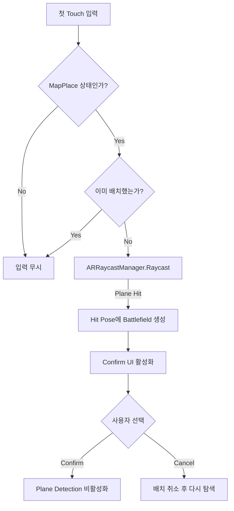

# AR Battlefield Placement

## 구현 목표

게임 전장을 현실 공간에서 검출한 Plane 위에 배치하고, 배치가 끝난 뒤에는 모바일 기기를 움직이며 전투를 관찰할 수 있도록 구성했습니다.

## 배치 흐름

## ARObjectPlacement

`ARObjectPlacement`에서 다음 흐름을 구현했습니다.

- 첫 번째 Touch 위치를 `TrackableType.Planes`에 Raycast
- `ARRaycastHit.pose`의 위치와 회전으로 Battlefield 생성
- `_mapHasBeenSpawned`로 중복 생성 방지
- Confirm과 Cancel에 따른 배치 상태 관리
- Confirm 이후 Plane Detection과 기존 Trackable 비활성화
- 배치 결과를 GameManager의 다음 게임 상태로 연결

## Unity 기능과 작성 코드의 역할

| Unity / Google 기능 | 프로젝트에서 연결한 동작 |
|---|---|
| ARCore | Android 기기의 AR Tracking 제공 |
| AR Foundation | 공통 AR API 제공 |
| XR Origin | Device Camera와 Trackable 좌표계 구성 |
| ARPlaneManager | 현실 공간의 Plane 관리 |
| ARRaycastManager | Touch 위치와 Plane의 교차점 계산 |
| `ARObjectPlacement` | 배치 조건, Battlefield 생성, 확인·취소 흐름 처리 |

AR 기능을 단순히 활성화하는 데 그치지 않고, Plane 탐색부터 전장 확정과 게임 상태 전환까지 하나의 플레이 흐름으로 연결했습니다.

