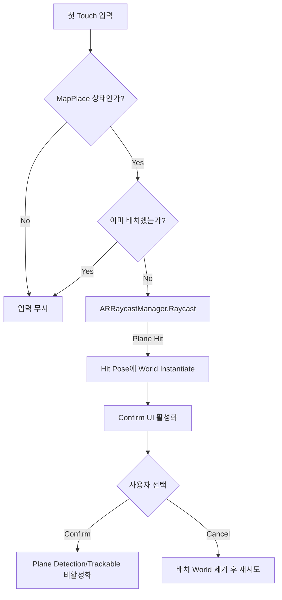

# AR Integration

## 구현 범위

이 프로젝트에서 직접 작성한 부분은 AR 추적 알고리즘이 아니라 Unity AR 기능과 Battlefield 배치 흐름의 통합입니다.

| Unity 및 Google 제공 | 프로젝트 코드가 담당한 연결 |
|---|---|
| ARCore Loader | Android AR 실행 환경 선택 |
| AR Foundation | 공통 AR API 사용 |
| XR Origin | 카메라와 Trackable 좌표계 제공 |
| Device Camera | 현실 화면 및 기기 추적 |
| ARPlaneManager | 검출 Plane 관리 |
| ARRaycastManager | 화면 Touch 위치의 Plane Raycast |
| `ARObjectPlacement` | 배치 조건, World 생성, Confirm/Cancel, Plane 탐지 종료 |

## Battlefield Placement Flow

## 코드에서 확인되는 동작

- `TrackableType.Planes`를 대상으로 Raycast
- `ARRaycastHit.pose` 위치와 회전 사용
- World 높이에 `Vector3.up * -0.7f` 보정 적용
- `_mapHasBeenSpawned`로 중복 배치 방지
- 확정 후 `requestedDetectionMode = PlaneDetectionMode.None`
- 확정 후 기존 Plane Trackable 비활성화

## 표현 시 주의

- `ARAnchor`를 사용하지 않으므로 Anchor 기반 배치라고 설명하지 않습니다.
- Device Camera와 Tracking은 Unity/ARCore 제공 기능입니다.
- 실제 기기 영상이 없는 상태에서 추적 안정성이나 성능 결과를 주장하지 않습니다.
- 원본 코드는 GameManager의 게임 상태에 의존하지만, 이 Repository에서는 해당 Manager를 복사하거나 대체하지 않습니다.

