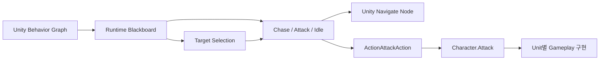
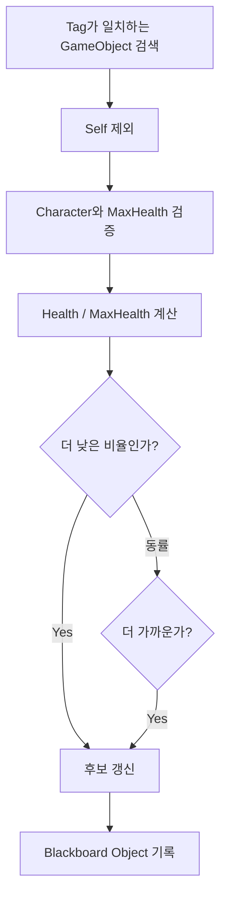
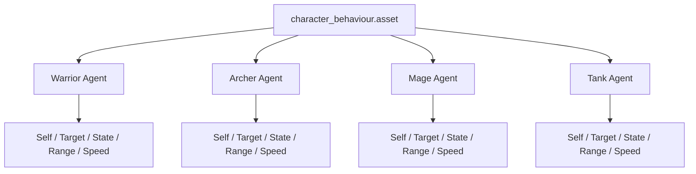

# AI Architecture

## 시스템 경계



Unity Behavior Graph는 판단과 행동 순서를 관리하고, C# Gameplay Component는 공격·회복과 Unit 스탯을 처리합니다. `ActionAttackAction`은 두 계층 사이의 연결 지점입니다.

## 일반 전투 Unit 흐름

일반 Unit Graph는 두 흐름을 병렬로 실행합니다.

### Target 및 State 판단

```text
Repeat
└─ Sequence
   ├─ Find Closest With Tag: Enemy
   ├─ Wait: 1 second
   └─ Distance Branch
      ├─ In Range  → State = Attack
      └─ Out Range → State = Chase
```

### State 실행

```text
Restart when State changes
└─ Switch State
   ├─ Chase  → Repeat Navigate To Target
   ├─ Attack → Distance Guard → ActionAttackAction
   └─ Idle   → 대기
```

Target 재탐색은 별도 Custom Node가 아니라 반복되는 기본 `Find Closest With Tag` Node가 담당합니다. 명시적인 `IsAlive` Node는 없으며, Target 파괴 시 null 처리와 다음 탐색 주기에 의존합니다.

## 기본 Node와 Custom 코드

| 구분 | 요소 | 역할 |
|---|---|---|
| Unity 기본 | Sequence, Selector, Repeat, Parallel | 실행 흐름 구성 |
| Unity 기본 | Restart, Switch | State 변경 대응 |
| Unity 기본 | Find Closest With Tag | 일반 공격 Target 탐색 |
| Unity 기본 | Navigate To Target, Look At, Wait | 이동·방향·주기 제어 |
| Unity 기본 | Check Distance, Branch, Guard | 사거리 판단 |
| Custom | `FindAllyWithLowestHealthRatioAction` | 게임 규칙 기반 지원 Target 선정 |
| Custom | `ActionAttackAction` | Behavior와 Gameplay 공격 연결 |
| Custom Data | `State` | Chase, Attack, Idle Blackboard 값 |

## Custom Target Selection

### 요구사항

가장 가까운 아군이 아니라 회복이 가장 시급한 아군을 지원 Target으로 선정해야 했습니다. Unit마다 최대 체력이 다르므로 절대 체력 대신 체력 비율을 비교합니다.

### Input과 Output

| 종류 | 값 |
|---|---|
| Input | `Self`, `Tag` |
| Output | `Object` Blackboard Target |
| Gameplay Data | `Character.Health`, `Character.MaxHealth` |

### 평가 과정



- 유효한 후보가 있으면 `Success`
- 후보가 없으면 `Failure`

## Multi Unit Graph 재사용



Graph asset은 공유되지만 각 Agent가 실행 시 사용하는 Runtime Graph와 Blackboard 값은 독립적입니다. Healer는 지원 대상 선정 요구사항 때문에 `healer_behaviour`를, Enemy는 Ally 탐색과 Waypoint fallback 때문에 `enemy_behaviour`를 사용합니다.

## 전시 Source와 생략된 코드

`Source/`에는 문제 해결을 가장 직접적으로 보여주는 파일만 포함했습니다. `Character`, GameManager, SoundManager, MonsterSpawner 등은 원본 프로젝트에 존재하지만 이 Repository에는 복사하지 않았습니다. 누락된 의존성은 새 코드로 대체하지 않고 [Dependencies.md](Dependencies.md)에 기록합니다.

