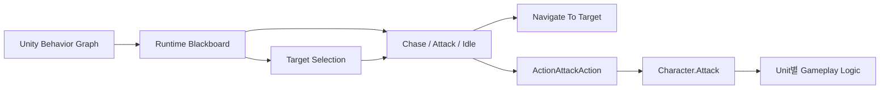
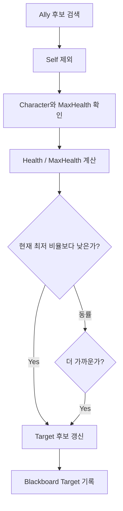
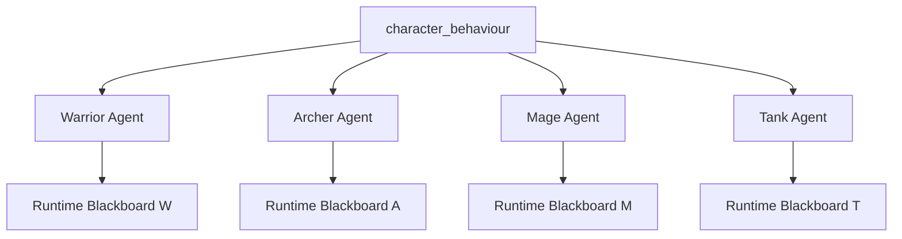

# AI Architecture

## 설계 목표

Autobattler의 Unit은 지속적으로 전장을 확인하면서 다음 행동을 결정해야 합니다.

```text
Target 탐색
→ 거리 판단
→ Chase 또는 Attack 결정
→ 행동 실행
→ Target 재탐색
```

Target을 판단하는 흐름과 실제 행동을 실행하는 흐름을 분리하고, 두 흐름을 병렬로 실행하도록 Behavior Graph를 구성했습니다.

## 전체 구조



Behavior Graph는 Target 탐색과 상태 전환을 담당합니다. C# Gameplay Component는 공격, 회복, 체력과 전투 스탯을 처리합니다. [`ActionAttackAction`](../Source/AI/Actions/ActionAttackAction.cs#L32-L64)을 두 계층의 연결 지점으로 사용했습니다.

## 일반 전투 Unit

### Target과 State 판단

```text
Repeat
└─ Sequence
   ├─ Find Closest With Tag: Enemy
   ├─ Wait: 1 second
   └─ Distance Branch
      ├─ In Range  → State = Attack
      └─ Out Range → State = Chase
```

### State 실행

```text
Restart when State changes
└─ Switch State
   ├─ Chase  → Repeat Navigate To Target
   ├─ Attack → Distance Guard → ActionAttackAction
   └─ Idle   → Wait
```

탐색 루프가 Target과 State를 계속 갱신하고, State가 바뀌면 `Restart → Switch`를 통해 실행 중인 행동을 전환합니다.

## 기본 Node와 Custom Action

| 구분 | 요소 | 사용 목적 |
|---|---|---|
| Unity Behavior | Sequence, Selector, Repeat, Parallel | 실행 흐름 구성 |
| Unity Behavior | Restart, Switch | State 변경 대응 |
| Unity Behavior | Find Closest With Tag | 일반 공격 Target 탐색 |
| Unity Behavior | Navigate To Target, Look At, Wait | 이동과 방향 제어 |
| Unity Behavior | Check Distance, Branch, Guard | 공격 범위 판단 |
| Custom Action | [`FindAllyWithLowestHealthRatioAction`](../Source/AI/Actions/FindAllyWithLowestHealthRatio.cs#L30-L92) | 회복 우선순위가 높은 Ally 선택 |
| Custom Action | [`ActionAttackAction`](../Source/AI/Actions/ActionAttackAction.cs#L32-L106) | Behavior와 Gameplay 공격 연결 |
| Blackboard Data | [`State`](../Source/AI/Blackboard/State.cs#L4-L10) | Chase, Attack, Idle 상태 공유 |

## Custom Target Selection

Healer의 Target은 거리보다 회복 우선순위가 중요합니다. 각 후보의 체력 비율을 계산하고 가장 낮은 값을 가진 Unit을 선택했습니다.



| 항목 | 값 |
|---|---|
| Input | `Self`, `Tag` |
| Output | `Object` Blackboard Target |
| Gameplay Data | `Character.Health`, `Character.MaxHealth` |
| Success | 유효한 Target을 찾고 Blackboard에 기록 |
| Failure | 조건에 맞는 후보가 없음 |

→ [후보 검증부터 Target 기록까지 전체 코드 보기](../Source/AI/Actions/FindAllyWithLowestHealthRatio.cs#L39-L92)

## Multi Unit Graph 재사용



공통 Graph에는 탐색, 이동, 공격의 순서를 정의했습니다. 각 Unit의 `BehaviorGraphAgent`에는 자신을 나타내는 Self와 Unit별 Speed, AttackRange를 설정하고, 실행 중 Target과 State를 독립적으로 유지했습니다.

→ [Healer의 Runtime Blackboard 변수 초기화 코드 보기](../Source/Gameplay/Units/Healer.cs#L22-L28)

