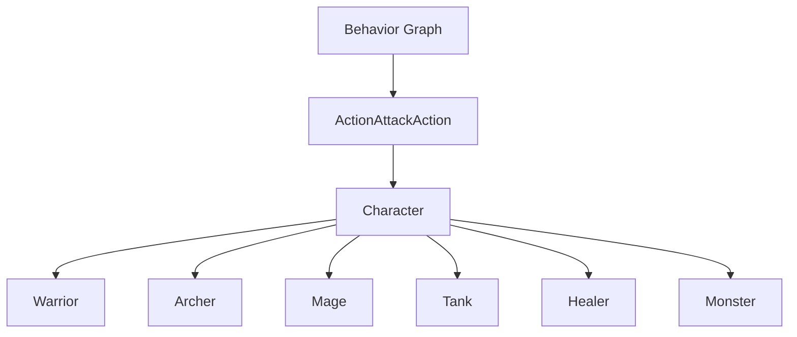

# Code Relationships

## AI와 Gameplay 연결



| 코드 | 연결 대상 | 역할 |
|---|---|---|
| `FindAllyWithLowestHealthRatio` | Unity Behavior, `Character` | 후보 Unit의 Health와 MaxHealth를 읽어 Target 결정 |
| `ActionAttackAction` | Unity Behavior, `Character` | Blackboard Agent/Target을 실제 공격 호출로 변환 |
| `State` | Unity Behavior Blackboard | 거리 판단 결과와 실행 행동 공유 |
| `Healer` | `Character`, `BehaviorGraphAgent`, Physics | Unit별 Blackboard 초기화와 범위 회복 |
| `ARObjectPlacement` | AR Foundation, GameManager | Plane 배치 결과와 게임 진행 상태 연결 |

## Unit 데이터 흐름

```text
Unit 생성
→ BehaviorGraphAgent의 Self 설정
→ Unit별 MoveSpeed / AttackRange 설정
→ Graph가 Runtime Target / State 갱신
→ Custom Action이 Gameplay Component 호출
```

## 프로젝트 시스템 연결

- `Character`: Health, MaxHealth, AttackPower, AttackRange와 Unit별 `Attack()` 제공
- `GameManager`: AR 배치, Tutorial, GameStart, GameOver, GameClear 상태 연결
- `MonsterSpawner`: Enemy 생성과 전투 종료 조건 관리
- `SoundManager`: 공격과 피격 효과음 재생

Repository에는 AI 확장과 AR 배치 흐름을 가장 직접적으로 보여주는 코드를 중심으로 담았습니다.

