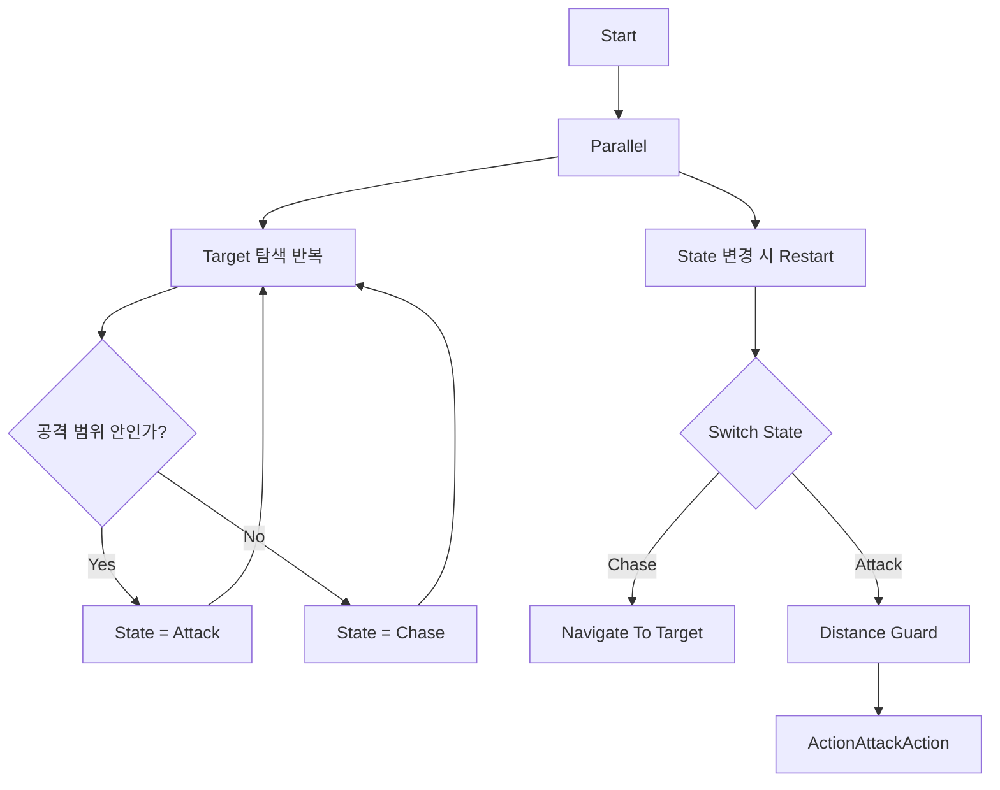

# AR Autobattler — AI & AR Code Portfolio

Unity 6 기반 AR Autobattler 프로젝트에서 직접 작성한 AI 및 AR 연동 코드를 선별한 코드 리뷰용 Repository입니다.

이 Repository의 목적은 게임을 다시 실행하거나 Unity 프로젝트를 재현하는 것이 아닙니다. 원본 프로젝트의 핵심 소스 코드를 수정 없이 보관하고, 생략된 Unity Asset과 외부 시스템의 관계를 문서로 설명합니다.

## 핵심 구현

### 1. 게임 규칙 기반 Custom Target Selection

Unity Behavior의 기본 최근접 탐색만으로는 회복이 가장 시급한 Unit을 선택할 수 없었습니다. `FindAllyWithLowestHealthRatioAction`은 후보 아군의 `Health / MaxHealth`를 비교하고, 체력 비율이 같으면 더 가까운 대상을 선택합니다.

- 최대 체력이 다른 Unit을 동일 기준으로 비교
- Self 및 유효하지 않은 `Character` 제외
- 거리 기반 tie-break
- 선택 결과를 Blackboard Target으로 전달

### 2. Target 판단과 행동 실행 분리

Target 탐색과 State 판단은 반복 실행하고, 실제 이동·공격은 별도의 State Subtree에서 수행하도록 구성했습니다.



### 3. 동일 Graph와 Unit별 Runtime Data

Warrior, Archer, Mage, Tank은 같은 Behavior Graph asset을 사용합니다. 행동 구조는 공유하지만 각 `BehaviorGraphAgent`의 Runtime Blackboard에서 `Self`, `Target`, `State`, `AttackRange`, `MoveSpeed`를 독립적으로 관리합니다.

Healer와 Enemy는 서로 다른 게임 요구사항 때문에 별도 Graph를 사용합니다. 따라서 “모든 Unit이 하나의 Graph를 사용한다”가 아니라 “일반 전투 Unit 네 종류가 공통 Graph를 재사용한다”가 정확한 설명입니다.

### 4. AR Battlefield Placement

AR Foundation의 Plane Raycast 결과를 게임 전장 배치 흐름에 연결했습니다.

```text
Touch
→ Plane Raycast
→ Hit Pose에 Battlefield 생성
→ Confirm / Cancel
→ 확정 후 Plane Detection 비활성화
```

ARCore, XR Origin, Device Camera와 Plane/Raycast Manager는 Unity 및 Google 제공 기능이며, 이 Repository의 코드는 해당 기능을 게임 배치 흐름에 연결하는 역할을 담당합니다.

## 선별 코드

| 코드 | 역할 |
|---|---|
| [`FindAllyWithLowestHealthRatio.cs`](Source/AI/Actions/FindAllyWithLowestHealthRatio.cs) | 체력 비율 기반 지원 Target 선정 |
| [`ActionAttackAction.cs`](Source/AI/Actions/ActionAttackAction.cs) | Blackboard Agent/Target과 Gameplay 공격 연결 |
| [`State.cs`](Source/AI/Blackboard/State.cs) | Chase, Attack, Idle 상태 정의 |
| [`Healer.cs`](Source/Gameplay/Units/Healer.cs) | Healer Blackboard 초기화와 범위 회복 |
| [`ARObjectPlacement.cs`](Source/AR/ARObjectPlacement.cs) | AR Plane 기반 Battlefield 배치 |

## 문서

- [AI 구조와 데이터 흐름](Docs/Architecture.md)
- [AR 통합 경계](Docs/ARIntegration.md)
- [외부 의존성](Docs/Dependencies.md)
- [공개 코드의 제한사항](Docs/KnownLimitations.md)
- [원본 경로와 동일성 기록](Docs/SourceManifest.md)

## Repository 범위

- 실행 가능한 Unity 프로젝트가 아닙니다.
- Scene, Prefab, Behavior Graph asset, `.meta`, Package 설정은 포함하지 않습니다.
- 누락된 시스템을 대체하기 위한 Stub, Mock 또는 재구현 코드는 포함하지 않습니다.
- `Source/`의 C# 파일은 원본 프로젝트에서 내용 변경 없이 복사했습니다.

