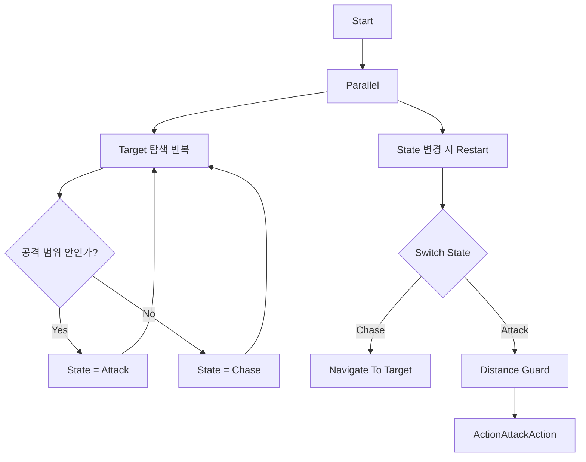

# AR Autobattler

Unity 6와 AR Foundation으로 개발한 개인 프로젝트입니다.

AR 공간에 배치한 전장에서 여러 Unit이 스스로 대상을 탐색하고, 이동하고, 공격하는 Autobattler를 구현했습니다. 개발 과정에서는 Unity Behavior의 기본 노드를 단순히 조합하는 데 그치지 않고, 전투 규칙에 필요한 Target Selection을 Custom Action으로 확장하는 데 집중했습니다.

## 구현 내용

### 게임 규칙에 맞춘 Target Selection

Healer는 가장 가까운 아군보다 회복이 가장 시급한 아군을 먼저 지원해야 했습니다. 기본 제공 탐색 Node만으로는 이 우선순위를 표현하기 어려워 [`FindAllyWithLowestHealthRatioAction`](Source/AI/Actions/FindAllyWithLowestHealthRatio.cs#L30-L92)을 직접 구현했습니다.

```text
Ally 후보 탐색
→ Self와 유효하지 않은 후보 제외
→ Health / MaxHealth 비교
→ 체력 비율이 가장 낮은 Unit 선택
→ 비율이 같으면 더 가까운 Unit 선택
→ Blackboard Target 갱신
```

절대 체력이 아닌 체력 비율을 사용해 최대 체력이 서로 다른 Tank, Warrior, Archer도 같은 기준으로 비교했습니다.

→ [체력 비율 비교와 거리 tie-break 코드 보기](Source/AI/Actions/FindAllyWithLowestHealthRatio.cs#L65-L88)

### 판단과 실행을 분리한 전투 AI

Target 탐색과 [`State`](Source/AI/Blackboard/State.cs#L4-L10) 판단은 반복해서 실행하고, 실제 이동과 공격은 별도의 State Subtree에서 처리했습니다. State가 변경되면 실행 중인 행동을 Restart하고 새로운 행동으로 전환합니다.



### 동일 Graph를 사용하는 여러 Unit

Warrior, Archer, Mage, Tank은 하나의 공통 Behavior Graph를 사용합니다. 행동 구조는 공유하지만 각 `BehaviorGraphAgent`가 별도의 Runtime Blackboard를 가지므로 Target과 State가 서로 섞이지 않습니다.

| 공통 행동 | Unit별 Runtime Data |
|---|---|
| Target 탐색 순서 | Self |
| 거리 기반 State 전환 | Target |
| Chase 이동 | State |
| Attack 실행 | AttackRange |
| Target 재탐색 | MoveSpeed |

Healer는 아군 지원 대상 선정이 필요하고, Enemy는 Ally 탐색과 Waypoint fallback이 필요해 각각 별도의 Graph로 구성했습니다.

→ [Unit 스탯을 Runtime Blackboard에 초기화하는 코드 보기](Source/Gameplay/Units/Healer.cs#L22-L28)

### Behavior와 Gameplay 연결

[`ActionAttackAction`](Source/AI/Actions/ActionAttackAction.cs#L32-L64)은 Blackboard에서 Agent와 Target을 받아 실제 Gameplay의 `Character.Attack(target)`을 호출합니다. Behavior Graph는 판단과 실행 순서를 담당하고, Character 계층은 Unit별 공격과 회복을 담당하도록 연결했습니다.

```text
Behavior Graph
→ Agent / Target Blackboard
→ ActionAttackAction
→ Character.Attack(Target)
→ Unit별 Gameplay Logic
```

### AR Battlefield 배치

AR Foundation의 Plane Raycast 결과를 이용해 현실 공간에 전장을 배치했습니다. 배치 위치를 확인하거나 취소할 수 있고, 확정한 뒤에는 Plane 탐지를 종료해 전투 관찰에 집중하도록 구성했습니다.

```text
Touch
→ Plane Raycast
→ Hit Pose에 Battlefield 생성
→ Confirm / Cancel
→ 확정 후 Plane Detection 비활성화
```

- [Plane Raycast와 Battlefield 생성 코드 보기](Source/AR/ARObjectPlacement.cs#L32-L49)
- [배치 Confirm과 Plane Detection 종료 코드 보기](Source/AR/ARObjectPlacement.cs#L54-L60)

## 주요 코드

| 코드 | 구현 내용 |
|---|---|
| [`FindAllyWithLowestHealthRatio.cs`](Source/AI/Actions/FindAllyWithLowestHealthRatio.cs#L30-L92) | 체력 비율 기반 지원 Target 선정 |
| [`ActionAttackAction.cs`](Source/AI/Actions/ActionAttackAction.cs#L32-L106) | Behavior와 Gameplay 공격 연결 |
| [`State.cs`](Source/AI/Blackboard/State.cs#L4-L10) | Chase, Attack, Idle 상태 정의 |
| [`Healer.cs`](Source/Gameplay/Units/Healer.cs#L22-L64) | Healer의 Blackboard 초기화와 범위 회복 |
| [`ARObjectPlacement.cs`](Source/AR/ARObjectPlacement.cs#L32-L68) | AR Plane 기반 Battlefield 배치 |

## 기술 문서

- [AI 구조와 데이터 흐름](Docs/Architecture.md)
- [AR Battlefield 배치 흐름](Docs/ARIntegration.md)
- [코드 연결 관계](Docs/Dependencies.md)

## 기술 스택

- Unity 6
- C#
- Unity Behavior
- AI Navigation / NavMesh
- AR Foundation
- ARCore
- XR Origin

`Source/`에는 제가 직접 작성한 코드 중 AI 확장과 AR 연동을 설명하는 핵심 파일을 선별해 담았습니다.

